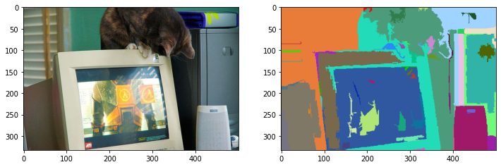
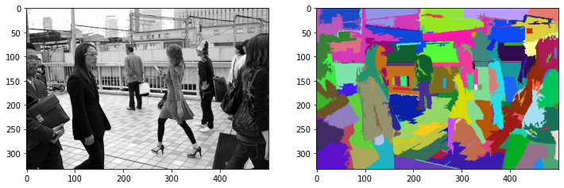
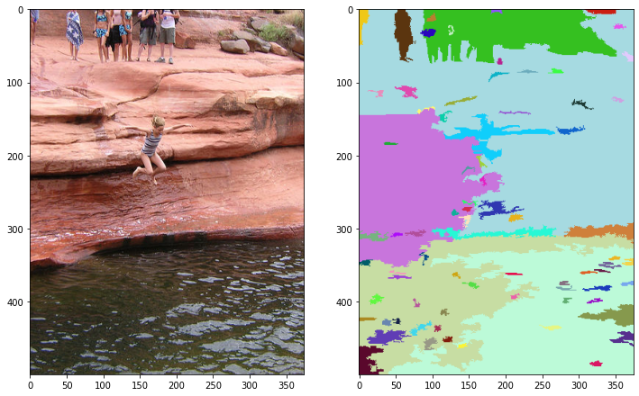

# Felzenszwalb Segmentation

Implementation of [Efficient Graph-Based Image Segmentation](http://people.cs.uchicago.edu/~pff/papers/seg-ijcv.pdf) by Pedro F. Felzenszwalb from Artificial Intelligence Lab, Massachusetts Institute of Technology and Daniel P. Huttenlocher from Computer Science Department, Cornell University.

**Article:** [Efficient Graph-Based Image Segmentation](https://soumik12345.github.io/geekyrakshit-blog/algebra/computervision/convolution/maths/python/2020/09/17/efficient-graph-based-image-segmentation.html)

## Usage

Install using `pip install felzenszwalb-segmentation`.

```python
from felzenszwalb_segmentation import segment

segmented_image = segment(in_image, sigma, k, min_size)
```

## Results





